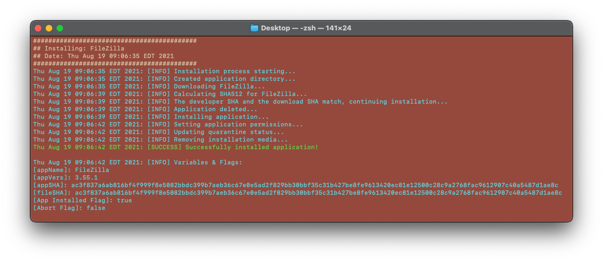

# macOS Software Installation, Management*, and Other Helpful Scripts*

This repository contains several useful scripts that range from software installation, management, or other general use for macOS. The specific applications have been grouped into categories and a tree is listed below with the offerings.

## Table of Contents

- [macOS Software Installation, Management*, and Other Helpful Scripts*](#macos-software-installation-management-and-other-helpful-scripts)
  - [Table of Contents](#table-of-contents)
  - [Offerings & "Build Status"](#offerings--build-status)
    - [Running Scripts](#running-scripts)
  - [What about Brew? 🍺](#what-about-brew-)
  - [JAMF Pro](#jamf-pro)
  - [Installation logging & Interpretation](#installation-logging--interpretation)
  - [Log Example](#log-example)
  - [About the Project](#about-the-project)
  - [Contributing](#contributing)
  - [Future Plans for this Project (\*)](#future-plans-for-this-project-)

## Offerings & "Build Status"

```
Software_Installers
 ┣ Audio, Video, Creative, & Broadcasting
 ┃ ┣ blender_latest.sh
 ┃ ┣ gimp_latest.sh
 ┃ ┣ handbrake_latest.sh
 ┃ ┣ open_broadcaster_software_latest.sh
 ┃ ┗ vlc_latest.sh
 ┣ Browsers
 ┃ ┣ brave_browser_latest.sh
 ┃ ┣ firefox_ESR_latest.sh
 ┃ ┗ google_chrome_latest.sh
 ┣ Code & Text Editors
 ┃ ┣ atom_editor_latest.sh
 ┃ ┣ bb_edit_latest.sh
 ┃ ┗ visual_studio_code_latest.sh
 ┣ Communication
 ┃ ┣ discord_latest.sh
 ┃ ┣ slack_latest.sh
 ┃ ┣ whatsapp_desktop_latest.sh
 ┃ ┗ zoom_video_conferencing_latest.sh
 ┣ Developer Tools
 ┃ ┣ github_desktop_latest.sh
 ┃ ┣ postman_latest.sh
 ┃ ┣ raspberry_pi_imager_latest.sh
 ┃ ┗ suspicious_package_latest.sh
 ┣ FTP Software
 ┃ ┗ filezilla_latest.sh
 ┣ Productivity
 ┃ ┣ evernote_latest.sh
 ┃ ┣ google_drive_latest.sh
 ┃ ┗ grammarly_desktop_latest.sh
```

| Application    | Script Run Status | Application         | Script Run Status |
| -------------- | :---------------: | ------------------- | :---------------: |
| Atom Editor    |        🟢         | Grammarly Desktop   |        🟢         |
| BB Edit        |        🟢         | HandBrake           |        🟢         |
| Blender        |        🟢         | OBS                 |        🟢         |
| Brave Browser  |        🟢         | Postman             |        🟢         |
| Discord        |        🟢         | Raspberry Pi Imager |        🟢         |
| Evernote       |        🟢         | Slack               |        🟢         |
| Firefox        |        🟢         | Suspicious Package  |        🟢         |
| Gimp           |        🟢         | Visual Studio Code  |        🟢         |
| GitHub Desktop |        🟢         | VLC                 |        🟢         |
| Google Chrome  |        🟢         | WhatsApp            |        🟢         |
| Google Drive   |        🟢         | Zoom                |        🟢         |

Status Updated: _August 19, 2021_

### Running Scripts
To easily test all scripts, there is a [script in the Testing directory](/Testing/test_all.sh) that will copy the contents of the `Software_Installer` directory, set permissions, and run all scripts.

## What about Brew? 🍺

Brew is awesome, check it out here: [Brew.sh](https://brew.sh).

Brew is a great tool for users who have administrative rights on their devices, or know how to configure for non-default installation. In other cases, it is likely the only administrators are via IT and their management systems. These scripts require sudo level access due to some of the commands being run, so they are mainly for those with additional permissions on their devices.

## JAMF Pro

These scripts work very well in JAMF Pro as an easy way to install software without needing to send much from your fileshare. In addition, they are very easy to make available in Self Service and easily can be maintained in a git repo - you should check out [git2jss](https://marketplace.jamf.com/details/git2jss/).

If managing scripts via git2jss, you will need to follow the structure used by JAMF below.

```
Script_Name
 ┣ script.sh
 ┗ script.xml
```

The `script.sh` houses the contents of your shell scripts and your `script.xml` contains the information used to populate the fields in JAMF Pro. Some examples are the name, category, description, specific naming for variables, etc.

## Installation logging & Interpretation

By default, the installation scripts will log to `~/Logs/Install/` with their respective application names. To quickly view install status via the logs, the log files will have macOS Finder Tags with the following colors and meanings.

| Tag Color | Description                                                                                                                                                      |
| :-------: | ---------------------------------------------------------------------------------------------------------------------------------------------------------------- |
|    🔴     | Script failed according to the cleanAndValidate function. More information on the next log line.                                                                 |
|    🟡     | Script started to run. If the script finished and the tag is still yellow, then there was likely something that caused it to exit before finishing installation. |
|    🟢     | Script completed sucessfully.                                                                                                                                    |

## Log Example



## About the Project

I am college student who has worked part-time as a student system administrator for macOS with JAMF Pro as the MDM provider. This project is simply a way to continue writing and cleaning up scripts that I find useful. All scripts have been tested on macOS Big Sur.

## Contributing

You are welcome to open issues and contribute your own internet installers that you think would be a good addition to this repository. Please note this is maintained when possible, and there is no guarantee that the scripts fit your needs. For more information about warranty and related info, please view the [license](/LICENSE).

1. Please create your own fork to make changes to.
2. Please use the templates where possible and follow the formatting utilized in this repository.
3. Please only use reputable sources for downloading applications - for example, only get Microsoft products from Microsoft, etc.
4. Ensure that your scripts run on the latest version of macOS.
5. Create a PR with relevant information (App name, App version, OS version tested on).

## Future Plans for this Project (\*)

- Create a better function for closing applications that handles several cases.
- Add additional application installers, management scripts, and other scripts.
- Add script to convert all scripts to the format required for uploading to JAMF via their API.
